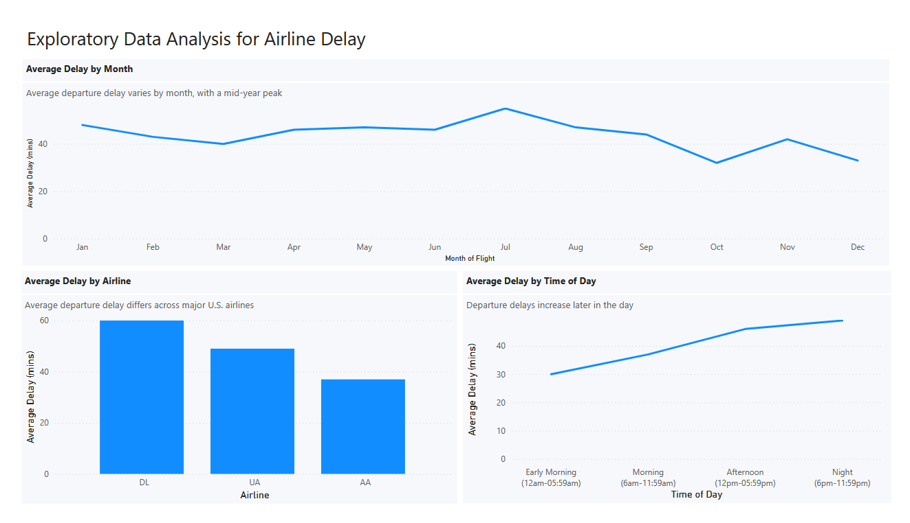
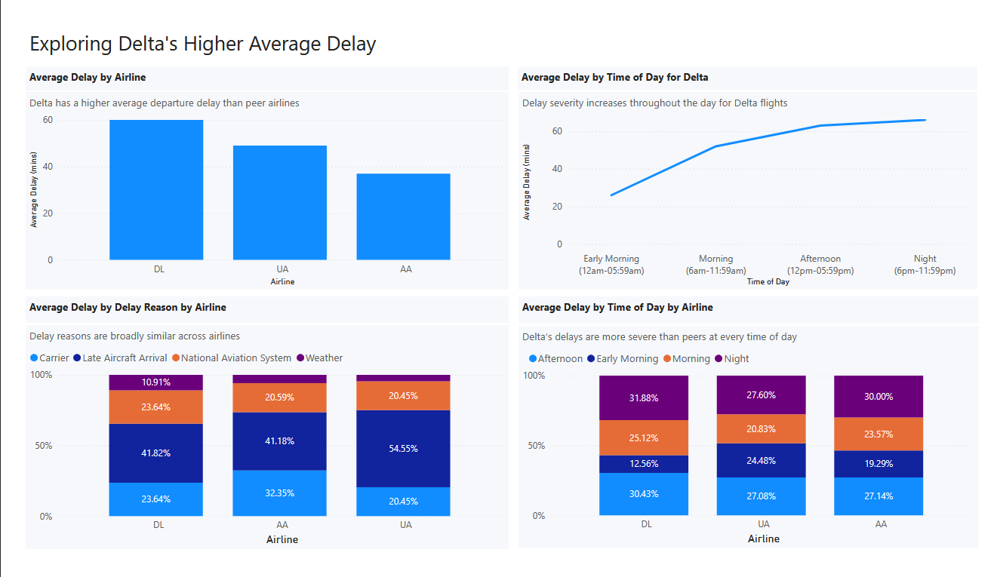
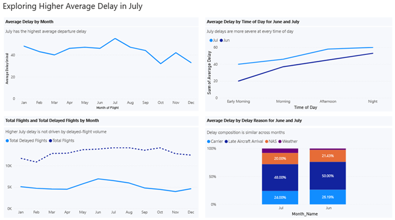

# Airline Delay Project

## Introduction
TODO

## Exploratory Data Analysis

TODO

## Branch 1: Delta Airlines' Higher Average Delay

Delta Airlines shows a higher average departure delay than its peer airlines, prompting an analysis into the drivers behind this difference. 

### Context
Baseline exploratory analysis showed that Delta Airlines consistently has a higher average departure delay compared to American Airlines and United Airlines. This analysis examines whether Delta’s higher delays are driven by unique delay causes or by greater delay severity under similar operational conditions. 

### Approach
The analysis followed a structured, step-by-step approach:
1.	Delta was identified as an outlier based on higher average delays observed in the baseline EDA.
2.	Delay reasons were compared across airlines to assess whether Delta experienced a unique cause for its higher delays.
3.	Delta’s average delay was analyzed by time of day to evaluate whether delay severity increased as the day progressed.
4.	This was expanded to include all airlines by time of day to determine whether Delta followed the same patterns or exhibited a unique delay reason.

### Key Findings
- Delta Airlines has a higher average departure delay than both American Airlines and United Airlines.
- Late aircraft arrival is the primary delay driver across all airlines, followed by carrier-related and National Aviation System (NAS) delays.
- Delay categories are similar across airlines, indicating that Delta’s delays are not caused by a unique delay type.
- Average delay severity increases steadily throughout the day for all airlines, with the highest delays occurring on night flights.
- Across each time-of-day period, Delta’s average delay is consistently more severe than that of the other airlines, which appears to be the main reason for its higher overall average delay.

### Interpretation
Although delay causes and time-of-day patterns are similar across airlines, Delta experiences greater delay severity under the same conditions. The steady increase in delays throughout the day suggests the presence of rolling delays, where late aircraft arrivals earlier in the day trickle down into later flights, leading to the highest delays on night flights.

While this pattern is observed across all airlines, the magnitude of Delta’s delays is consistently higher. This suggests that further analysis could focus on why certain delay drivers, such as late aircraft arrivals, are more severe for Delta and whether adjustments to scheduling structure or recovery strategies could help reduce downstream delay severity.

## Branch 2: July's Higher Average Delay

July has the highest average departure delay of any month, prompting analysis into the drivers behind this seasonal pattern. 

### Context
Exploratory analysis showed that July stands out as the month with the highest average departure delay. This analysis examines whether July’s higher delays are driven by increased flight volume, unique delay causes, or greater delay severity under similar operating conditions.

### Approach
The analysis followed a structured, step-by-step approach:
1.	July was identified as the month with the highest average delay based on baseline EDA.
2.	Total flight volume and delayed-flight volume were compared across months to assess whether volume explained the higher average delay.
3.	June was selected as a comparison month due to its high number of delayed flights.
4.	Average delay by time of day was compared between June and July to assess differences in delay severity patterns.
5.	Delay reason composition was examined to determine whether July experienced a distinct mix of delay causes.

### Key Findings
- July has the highest average departure delay among all months.
- June has the highest number of delayed flights, while July has the highest total flight volume, indicating that delayed flight count alone does not explain July’s higher average delay.
- Both months exhibit similar time-of-day delay patterns, with delays increasing later in the day; however, July shows consistently higher delay severity at every time period.
- Delay reason composition is similar between June and July, ruling out changes in delay reasons as a main factor.

### Interpretation
July’s higher average delay is driven by consistently greater delay severity rather than by a higher number of delayed flights or a distinct delay cause. While both June and July experience increasing delays later in the day, July’s delays are more severe across all time periods. This suggests that seasonal factors such as higher operational strain during peak summer travel may amplify the severity of existing delay drivers rather than introducing new ones.
